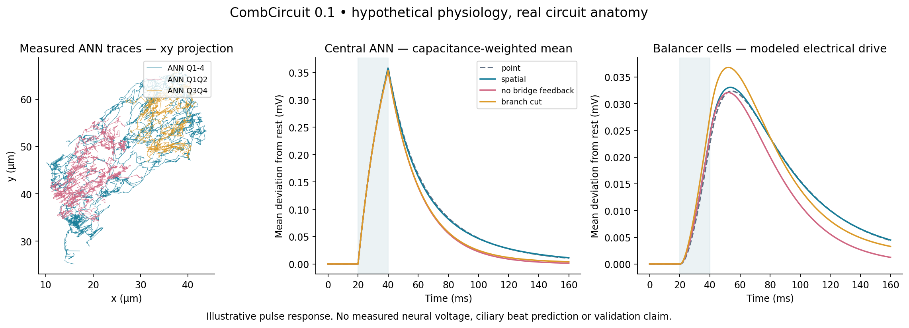

# CombCircuit

Does a neuron's branching geometry change the way a circuit responds?
CombCircuit explores that question in a selected balance-organ circuit of the
comb jelly *Mnemiopsis leidyi*. It runs a spatial electrical model alongside a
model that gives each cell one voltage, using the same reconstructed contacts,
matched cell capacitance and current input.

**The anatomy is measured; the electrical properties are assumptions.** This is
an exploratory research workbench, not a validated simulation of a whole animal.
The reconstruction belongs to Jokura and colleagues, credited below.



## Try it

Download this repository as a ZIP, extract it, and open **LIVE.html** in your
browser. No installation, account, internet connection or server is needed.
JavaScript and Web Workers must be enabled. Chromium was tested for this release.

1. Press **Run** to watch the default current pulse.
2. Click an ANN branch to add a local voltage probe.
3. Choose **Move injection site**, click another branch, and press **Inject now**.
4. Add an individual bridge or balancer cell from **Any cell**.
5. Change a parameter and press **Apply parameters now**. Reset for a new trial
   from rest, and export before resetting or changing the probe set.

## What you can change

- Probe any of the 158 selected cells or any reconstructed ANN compartment;
  display up to 12 chosen channels at once.
- Inject positive or negative current at a clicked branch or selected cell.
- Adjust cable radius, axial resistivity, capacitance, leak, synaptic current
  scale, voltage sensitivity, uniform contact sign and internal conductance.
- Disable bridge-to-ANN feedback or disconnect one selected cable edge.
- Export the recorded traces and a log of settings and interventions.

The full spatial model has 16,601 compartments and 280 directed contacts. It runs
in a browser worker alongside a 158-cell point model, with a fixed 0.5 ms step.
The speed control changes wall-clock pacing, not the numerical timestep.

## Guide 

- [Complete illustrated PDF guide](docs/CombCircuit-Live-Complete-Guide.pdf)
- [Model equations](docs/MODEL.md), [live solver notes](docs/LIVE_MODEL.md)
  and [data audit](docs/DATA_AUDIT.md)
- [Research plan](docs/STUDY_PLAN.md)

The video uses a synthetic voice and includes captions. `EXPLORE.html` and
`README-v0.1.md` preserve the original fixed four-scenario comparison.

## Rebuild and check

Using Python 3.11 or newer, from the repository folder:

```bash
python3 -m venv .venv
source .venv/bin/activate
python -m pip install -r requirements.txt
python build_live.py
python -m unittest discover -s tests -v
```

On Windows, activate with `.venv\Scripts\activate`. The JavaScript/Python
comparison test also requires Node.js and is explicitly skipped when Node is
absent. Neither Python nor Node is required to use the downloaded HTML app.

`python combcircuit.py` regenerates the original baseline comparisons and
sensitivity sweep. `python build_live.py` regenerates the live page. Source
files and SHA-256 hashes are bundled in `data/`, so reruns use a fixed snapshot.

The release passed ten numerical test methods. Full-state JavaScript results
agreed with a SciPy reference to about 1.5e-10 mV across nine scenarios, including
cuts, negative input, individual-cell stimulation and a parameter change mid-run.
See `results/live_verification.json` and `results/live_browser_checks.json`.
These checks test implementation, not biological accuracy.

## What the results can and cannot tell you

The central question is whether local readouts distinguish models that look
similar when averaged over a cell. In the default pulse experiment, the central
cell means are nearly identical, while the stimulated local compartment differs
substantially between spatial and point models. That is a result of the specified
assumptions, not a measured property of the animal.

Only three ANN cells have explicit morphology. Exported skeleton trees may omit
internal syncytial loops, and cable radius is assumed uniform. Synaptic strength
and sign are not measured here. The model does not implement action potentials,
calcium signals, ciliary mechanics, behavior or learning.

Live parameter changes retain voltage. In particular, changing capacitance this
way is an artificial intervention; reset for controlled comparisons. The browser
retains 10,000 recent samples, and changing probes starts a fresh trace window.
JSON exports are experiment logs, not resumable full-state checkpoints.

## Sources and attribution

- Jokura et al., [Neural connectome of the ctenophore statocyst](https://elifesciences.org/articles/108420).
- [Original data and code](https://github.com/JekelyLab/Jokura_2024_ctenophore_apical_organ),
  pinned to commit `ccdc5b2d8e897dcb4d1df1d4a651b6925844320a`.
- CATMAID arbors were retrieved separately on 2026-09-27; exact source URLs and
  hashes are recorded in `data/provenance.json`.

I did not map these cells. The project's contribution is the modeling workbench
and comparisons built on the original anatomy. No endorsement or established
scientific novelty is claimed. Code is GPL-3.0; see [LICENSE](LICENSE) and
[THIRD_PARTY_NOTICES.md](THIRD_PARTY_NOTICES.md) for upstream attribution and terms.
